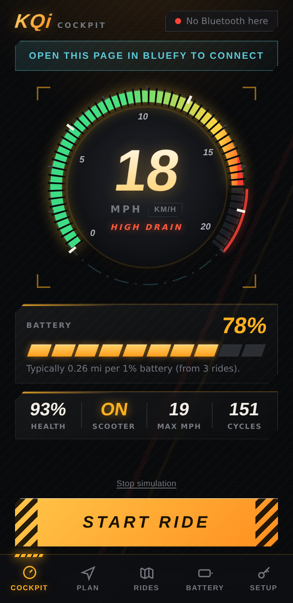
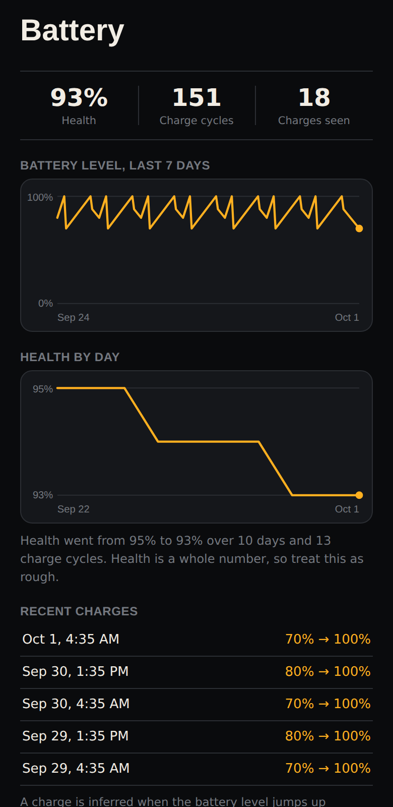
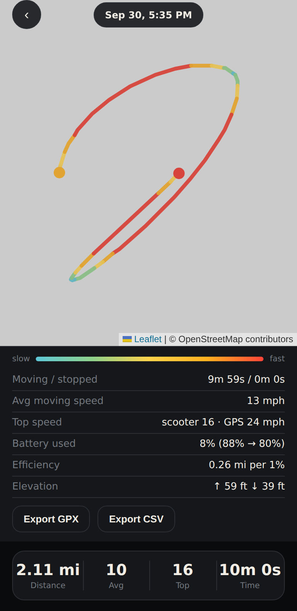
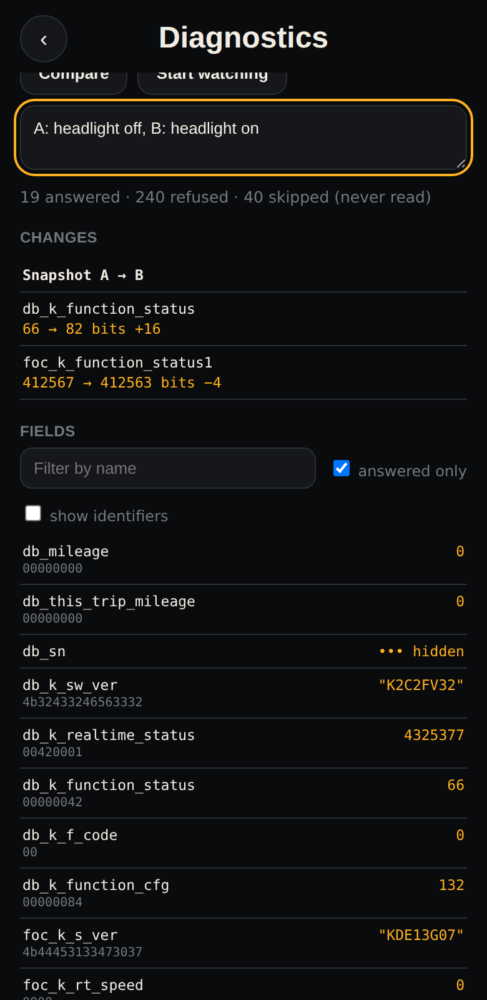

# NIU Companion — KQi Cockpit (Web Dashboard)

A privacy-first, **read-only** Web Bluetooth dashboard for the NIU KQi 200F. Runs in any
Web Bluetooth capable browser — **Bluefy on iOS**, Chrome on desktop/Android — with no native
build, no App Store and no NIU account *in the app*.

It shows live speed, battery %, battery health, power state and the scooter's top speed, and
records rides (GPS route, distance, top/average speed) on-device.



Battery history and a ride's insights (synthetic data, rendered in headless Chromium; the map
is blank only because the sandbox had no network for map tiles):

  

## What it does and doesn't do

- **Reads** status from the scooter over Bluetooth: speed, battery %, battery health, charge
  cycle count, powered on/off, fault code, top speed, rated voltage.
- **Keeps a battery history** on the device: battery %, health, charge cycles and power state
  over time, with charts, inferred charges, and a health trend (the app can only see the
  battery while connected, so charges are inferred from jumps between connections).
- **Estimates your range** from your own real rides (pooled miles-per-percent, labelled
  "rough" until there is enough data; simulated demo rides are never counted).
- **Ride insights:** moving vs stopped time, scooter vs GPS top speed, battery used,
  efficiency, elevation, and a route coloured by speed.
- **Exports** a ride as GPX or CSV, all rides as a CSV summary, and the battery history as
  CSV — via the share sheet if the browser offers one, else a download, else the clipboard.
- **Diagnostics (Setup tab):** a read-only field explorer. It scans which of the 299 known
  fields your scooter answers, shows raw bytes next to decoded values, compares two snapshots
  (so you can see which bits flip when you press something on the scooter), watches values
  change live, and exports a redacted report. It never reads credentials (PINs, passwords, NFC
  cards) or command registers, hides identifiers (serial numbers, MAC addresses, ...) on screen
  until you ask, and always removes them from exports.
- **Never writes.** There are no lock, headlight, mode or setting controls, and the protocol
  module has no command builders — a test fails if one is ever added. (The NIU protocol has
  no headlight on/off command anyway.)
- **Needs two per-scooter secrets** (Bluetooth password + AES key), entered once in the Setup
  tab and stored only in this browser. See "Getting your scooter keys" below.

## Status: what is verified, and what isn't

**Verified by the automated tests (`npm test`, 239 tests, no scooter needed):**

| Area | How it is checked |
| --- | --- |
| AES-128 + MD5 (hand-written, browsers have neither ECB nor MD5) | FIPS-197 vector, RFC 1321 suite, and thousands of random inputs against Node's crypto |
| Frame format, handshake, read requests/replies | Byte-for-byte against a separate reference implementation (`test/fixtures/niu_vectors.json`, made-up test keys) |
| Session logic: handshake, refusals, timeouts, polling, reassembly | Against a simulated scooter written independently of the app's code |
| Web Bluetooth call sequence, read-only guarantee | Against a fake `navigator.bluetooth` |
| Ride stats, range estimate, battery-history rules, charge inference, health trend, charts, GPX/CSV | Unit tests on synthetic rides and samples with hand-computed answers |
| The whole app end to end (connect, record a ride, battery history, insights, exports) | jsdom, against the simulated scooter through the fake Bluetooth, with fake GPS |
| Diagnostics: what is never read, what is always redacted, scan/diff/watch/report | Unit tests with tripwires on the field catalogue, plus end-to-end runs against the simulated scooter |
| UI wiring, Setup flow, no third-party scripts | jsdom |

**Verified on a real KQi 200F (by hand, using the separate `niu-kqi` command-line tool, not
this web app):** the service/characteristic UUIDs, the BLE-10 handshake, and status reads —
including battery % matching the scooter's own display.

**Verified on a real iPhone (Bluefy) with a KQi 200F, by hand:** the app connects, completes
the handshake with the saved keys, shows the live battery %, and the live speed moves and
roughly matches the scooter's own display. The battery health (93%), power state (ON) and top
speed (30 km/h) readouts also match what the `niu-kqi` command-line tool read from the same
scooter.

**Battery history, range, insights and export** have been tested in code and by rendering
them with synthetic data (screenshots below are synthetic), but **not yet on a real phone over
real use**. Still unverified there: whether the share sheet or download works in Bluefy, how
accurate the range estimate becomes, and the speed-coloured route on a real ride.

**Still not verified:**

- **Speed accuracy.** Speeds are reported as km/h × 10. The scale is confirmed for the top-speed
  field, and the live speed looked right by eye, but it hasn't been compared precisely.
- A full **recorded ride** with GPS and a saved route.
- Odometer isn't shown (no field has been confirmed for it).

## Running the tests

```bash
npm install
npm test
```

Twelve suites: `crypto`, `fields`, `protocol`, `session`, `ble`, `keystore`, `insights`, `exporters`, `battery`, `diagnostics`, `geo`, `dom-wiring`.

## Getting your scooter keys (one time)

The scooter authenticates with two per-vehicle secrets that NIU stores on its server and the
official app downloads after login. This app can't fetch them (browsers can't call NIU's API,
and it keeps the app account-free), so fetch them once with the open-source
[`niu-kqi`](https://github.com/BaesTheorem/niu-kqi) tool on a Mac:

```sh
git clone https://github.com/BaesTheorem/niu-kqi && cd niu-kqi
uv venv --python 3.13 .venv && uv pip install --python .venv/bin/python -r requirements.txt
bin/kqi login your-niu-email          # password is prompted
bin/kqi setup --mac auto              # scooter on, within range
```

That writes `secrets/scooter.json`. Open the **Setup** tab in the cockpit and paste that file's
contents (or the password and AES key on two lines). Treat the file like a password: don't
commit it, share it or paste it into chats. Remove the keys in Setup before handing the device
to anyone else.

Only do this for your own scooter.

## Running it for real

Web Bluetooth requires a **secure context** (HTTPS, or `localhost`); it will not work from a
`file://` path.

**Option A — GitHub Pages (free, permanent HTTPS):** push this repo, enable Pages on the
branch, then open the `https://<you>.github.io/<repo>/` URL in Bluefy.

**Option B — local testing:** `npm run serve` (port 8080). Bluefy generally needs HTTPS, so for
the phone use a tunnel (e.g. `ngrok http 8080`) or Pages.

### Using it in Bluefy
1. Open the hosted HTTPS URL in Bluefy.
2. Setup tab → paste your keys → **Save keys**.
3. Turn the scooter on, close the NIU app and anything else connected to it (the scooter
   accepts one connection at a time), then tap **Connect to scooter** and pick it.
4. To get back to it quickly, bookmark the page inside Bluefy. Bluefy may not offer
   *Add to Home Screen*, and a Home Screen shortcut made from Safari would open in Safari,
   which has no Web Bluetooth, so don't use that.

### No scooter handy?
Tap **Simulate telemetry** on the Cockpit screen — it feeds fake data through the same
`applyTelemetry()` path real notifications use.

## Limitations

- **Only "BLE version 10" scooters** (service UUID ending `…daea50`, which is the KQi 200F).
  Newer KQi models use a different handshake (`…daea51`) or frame format (`…daea52`); the app
  detects them and says so instead of misbehaving.
- **No background logging.** WebKit suspends pages, timers, GPS and Bluetooth when the screen
  locks or Bluefy is backgrounded. The app requests a Screen Wake Lock during a ride
  (best-effort). A locked screen means a gap in the recorded track, not corrupted data.
  Uninterrupted background logging needs a native iOS app.
- **No automatic reconnect after a page reload.** Web Bluetooth always needs a fresh tap.
  Within one page session, a dropped link can be re-established without the picker.
- **The scooter may power itself off when idle**, which ends the session; reconnect after
  turning it on.
- **The range estimate is only an estimate.** Battery % is a whole number, hills, load and
  temperature change consumption, and battery behaviour is not linear near empty. It pools
  your recent real rides and says "rough" until there are at least 3 rides and 15% of battery
  used.
- NIU has not published this protocol. It was reverse-engineered by others and can change in a
  firmware or app update.

## Privacy

- No accounts, analytics or crash reporters; no NIU cloud calls from this app.
- Ride history and battery history are in IndexedDB and the scooter keys are in localStorage — on-device only.
- Exports are generated on the device. Where they go next (Files, Messages, email…) is up to you in the share sheet.
- **No third-party scripts.** Leaflet is vendored (`vendor/leaflet/`, pinned and hash-recorded)
  specifically so no other host's JavaScript can run in the same origin as the stored keys.
- The remaining outbound requests are non-script: Google Fonts CSS, and OpenStreetMap map tiles
  when you open a ride's map (they see the map area you view, not your ride data).
- The stored keys are readable by anything that can use this browser profile. Remove them in
  Setup when they're no longer needed.

## Protocol (short)

One GATT service per scooter; notify on `…e31`, write on `…e32` (same suffix as the service).
Every frame is 20 bytes: `header(2) | index(1) | AES-128-ECB block(16) | checksum(1)`, with
the checksum being the sum of the preceding bytes mod 256. Authentication sends
`01 23 01 + AES_pwd(random)` then `01 03 00 + AES_pwd(md5(random ‖ reply ‖ pwd))`; data
frames then use the `bleAes` key. Fields are addressed by 3-byte codes and read in a
request/response pattern — the scooter sends nothing until asked. Details and credits:
`js/protocol.js`, `NOTICE.md`.

## Project structure

```
index.html            Cockpit, Rides, Battery and Setup screens, tab bar, ride-detail overlay
manifest.json         PWA manifest (only used by browsers that support installing web apps)
css/style.css         OLED dark theme
js/
  constants.js        Service UUIDs, characteristic mapping, frame headers
  crypto.js           AES-128 block cipher + MD5 (the protocol needs both)
  protocol.js         Pure frame build/parse, handshake, field decoding — read-only
  session.js          Handshake, reads, refusal fallback, polling (transport-agnostic)
  ble.js              Web Bluetooth transport + connection state
  keystore.js         Parse/validate/store the scooter keys (localStorage)
  storage.js          IndexedDB ride history
  battery.js          Battery-history store, record rules, charge inference, health trend
  insights.js         Ride stats, range estimate, speed-coloured route (pure)
  exporters.js        GPX / CSV generation and share / download / clipboard delivery
  charts.js           Tiny dependency-free SVG line charts
  fields.js           Catalogue of all 299 known fields (GENERATED by tools/gen_fields.py)
  diagnostics.js      Read-only scan / snapshot diff / watch / redacted report, and the safety policy
  diag-ui.js          The Diagnostics screen (renders scooter values with textContent only)
  geo.js              Foreground GPS trip recording (haversine distance)
  app.js              Wires everything to the DOM
vendor/leaflet/       Vendored Leaflet 1.9.4 (BSD-2)
tools/                gen_fields.py (regenerates js/fields.js from the source field table)
test/                 One *.test.js per suite, fixtures/ and helpers/
NOTICE.md             Credits and third-party licences
```
